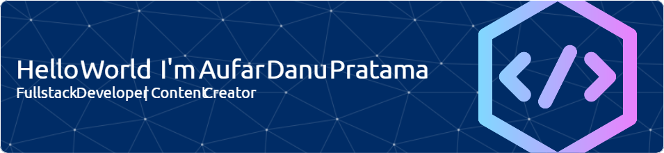

## Hello Word I'm Aufar 👋

<!--
**aufardp/aufardp** is a ✨ _special_ ✨ repository because its `README.md` (this file) appears on your GitHub profile.

Here are some ideas to get you started:

- 🔭 I’m currently working on ...
- 🌱 I’m currently learning ...
- 👯 I’m looking to collaborate on ...
- 🤔 I’m looking for help with ...
- 💬 Ask me about ...
- 📫 How to reach me: ...
- 😄 Pronouns: ...
- ⚡ Fun fact: ...
-->

🔭 I’m currently working on **Telkom Akses Indonesia**
🌱 I’m currently learning **React Framework** and **Laravel
Framework**
I still consistent
⚡ Fun fact: I love coffee

##### Connect with me

<!-- 

  

 -->

##### Skills

##### Frameworks & Library

##### Database

<h2 align="left">Play With Me ...</h2>

###

###

<picture>
  <source media="(prefers-color-scheme: dark)" srcset="https://raw.githubusercontent.com/aufardp/aufardp/output/pacman-contribution-graph-dark.svg">
  <source media="(prefers-color-scheme: light)" srcset="https://raw.githubusercontent.com/aufardp/aufardp/output/pacman-contribution-graph.svg">
  
</picture>

###
